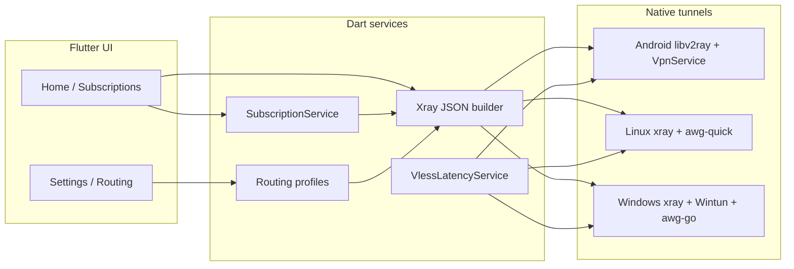

<div align="center">

# AsteriaRay

**Open-source cross-platform VPN client — VLESS subscriptions, AmneziaWG, Happ-style routing.**

Flutter UI · native tunnels · Xray-core · dark neon interface

[](https://flutter.dev)
[](https://github.com/Reei-dp/AsteriaRay/releases)
[](https://github.com/Reei-dp/AsteriaRay/releases)

[Download latest release](https://github.com/Reei-dp/AsteriaRay/releases) · [Telegram bot](https://t.me/asteria_vpn_bot)

</div>

---

## Why AsteriaRay

**AsteriaRay is an open-source VPN client** — not tied to a single provider. Use it with **any** VLESS subscription feed or standalone `vless://` configs, plus AmneziaWG `.conf` files.

It implements the same formats popular clients use: **subscription URLs** (`/api/sub/…`), **traffic & expiry headers**, **Happ routing profiles** (`happ://routing/onadd/…`), and **magnet import** (`asteriaray://add/…`). Works with Asteria, Happ-compatible panels, and other Xray-based services.

| | |
|---|---|
| **Subscriptions** | Any `https://…/api/sub/{uuid}` — auto-refresh, ping, pin, edit |
| **Single configs** | `vless://…` URI, QR scan, clipboard, file import |
| **AmneziaWG** | Full `.conf` profiles on Android / Linux / Windows |
| **Routing** | Happ `happ://routing/onadd/…` from subscription headers — geo rules, DNS, split tunnel |
| **Desktop** | System tray, narrow window, Linux & Windows native sidecars |

> Use [@asteria_vpn_bot](https://t.me/asteria_vpn_bot) if you want an Asteria subscription — optional, not required.

---

## Subscriptions (VLESS)

Add a subscription URL from **any provider** that serves base64 VLESS lines (Happ-style feeds).

### Add a subscription

| Method | How |
|--------|-----|
| **Clipboard** | Tap **+** — if the buffer contains a subscription URL, it imports immediately |
| **Magnet link** | `asteriaray://add/https://…/api/sub/{uuid}` — from a provider page, bot, or your own link |
| **Manual URL** | Paste `https://your-host/api/sub/xxxxxxxx-xxxx-xxxx-xxxx-xxxxxxxxxxxx` |

The client fetches **base64-encoded VLESS lines** (`text/plain`), parses metadata from HTTP headers (`subscription-userinfo`, `profile-title`, `profile-update-interval`, routing headers), and keeps nodes in sync with the server.

### Subscription block (Happ-style UI)

- **Refresh** — manual or automatic (interval from server, default 3 h)
- **Ping** — parallel latency test (3 workers, 5 s timeout per node); results stream in per server
- **Menu ⋮** — refresh, ping all, edit URL/options, pin, delete
- **Traffic & expiry** — shown when the backend sends `subscription-userinfo`
- **Options** — HWID in Cookie, allow insecure TLS, hide server settings (per subscription)

### Deep link format

```
asteriaray://add/https://your-host/api/sub/xxxxxxxx-xxxx-xxxx-xxxx-xxxxxxxxxxxx
```

The URL after `add/` must be the **API feed** (`/api/sub/…`), not the HTML page — same rule as Happ (`happ://add/…`).

---

## Protocols & platforms

Tunneling works only where marked **✅**. macOS / iOS builds exist for UI work; **connect is not implemented** there yet.

| Protocol | Android | Linux | Windows | macOS | iOS |
|----------|:-------:|:-----:|:-------:|:-----:|:---:|
| **VLESS** (Xray) | ✅ | ✅ | ✅ | ❌ | ❌ |
| **AmneziaWG** | ✅ | ✅ | ✅ | ❌ | ❌ |
| OpenVPN | ❌ | ❌ | ❌ | ❌ | ❌ |
| L2TP / IPsec | ❌ | ❌ | ❌ | ❌ | ❌ |

### VLESS transports & security

- **Security:** `none`, TLS, **Reality**
- **Transports:** TCP, WebSocket, gRPC, HTTP/2, **XHTTP** (`stream-up`, `packet-up`, …)
- **Flow:** XTLS vision where configured
- **Core:** Xray on all tunnel platforms (libv2ray on Android, sidecar `xray` on desktop)

### AmneziaWG

Import WireGuard-style `[Interface]` / `[Peer]` configs. Uses the **AmneziaWG** stack (not stock WireGuard unless the config matches).

---

## Routing (Happ-compatible)

**Settings → Routing** — profiles imported from subscription feed or defaults.

- Parse **`happ://routing/onadd/{base64}`** from subscription HTTP headers/body
- **GeoIP / Geosite** lists (Loyalsoldier fallback + URLs from backend profile)
- **DNS** — remote/domestic, DoU / DoH; applied in Xray when VPN is active
- **Rule editor** — geosite, geoip, domain, IP CIDR
- Default profile **「Asteria DNS」** (Cloudflare DoU + private → direct)

---

## Import cheat sheet

Tap **+** in the app:

| Source | What to paste / open |
|--------|----------------------|
| **Clipboard** | `vless://…` or `https://…/api/sub/{uuid}` |
| **QR scan** | `vless://` or subscription URL |
| **From file** | `.conf` (AmneziaWG) or VLESS lines |
| **Manual** | VLESS form · AmneziaWG form |

**VLESS URI example**

```
vless://uuid@host:443?security=reality&type=xhttp&path=/…&host=…&sni=…&fp=chrome&pbk=…&sid=…#🇩🇪 Germany
```

---

## Features

- **Localization** — English, Русский, Українська
- **Cascade nodes** — display uses **entry country** flag (e.g. 🇷🇺 for Russia → Germany)
- **VPN** — full tunnel via TUN; DNS via tunnel or DoH (settings)
- **Stats** — upload/download where the platform exposes them (Android)
- **Desktop tray** — show/hide, quit; Linux StatusNotifier / Windows tray
- **Secure storage** — sensitive prefs where supported
- **Release builds** — GitHub Actions: APK (split + universal), Linux `.tar.xz`, Windows Inno Setup

---

## Architecture



| Layer | Role |
|-------|------|
| `lib/notifiers/` | `SubscriptionNotifier`, `VpnNotifier`, `RoutingNotifier`, profiles |
| `lib/services/` | Fetch/parse subscriptions, Xray config, geo files, deep links |
| Android | Kotlin — `LibxrayVpnService`, parallel ping pool, `asteriaray://` intent |
| Linux | `VpnPlatformLinux` — Xray process, routes, AmneziaWG tools |
| Windows | `VpnPlatformWindows` — Xray + Wintun; **run as Administrator** |

Entry point: `createVpnPlatform()` in `lib/services/vpn_platform.dart` → **Android**, **Linux**, **Windows** only.

---

## Quick start

### Users

1. [Download a release](https://github.com/Reei-dp/AsteriaRay/releases) for your OS.
2. Add a subscription URL (`https://…/api/sub/…`) or a single `vless://` config — e.g. from [@asteria_vpn_bot](https://t.me/asteria_vpn_bot) or your provider.
3. Tap **+ → from clipboard** or open a magnet link.
4. Pick a server, connect.

### Developers

```bash
git clone https://github.com/Reei-dp/AsteriaRay.git
cd AsteriaRay
flutter pub get
```

<details>
<summary><b>Android</b></summary>

`libv2ray.aar` is vendored under `android/app/libs/`. Rebuild with `scripts/build_libxray_aar.sh` when bumping Xray.

```bash
flutter build apk --release
# or split APKs via CI / release workflow
```

</details>

<details>
<summary><b>Linux</b></summary>

```bash
sudo apt install -y clang cmake ninja-build pkg-config libgtk-3-dev liblzma-dev \
  libsecret-1-dev libayatana-appindicator3-dev libdbusmenu-gtk3-dev
./tools/fetch_xray_linux.sh
./tools/fetch_amneziawg_tools_linux.sh
./tools/fetch_amneziawg_go_linux.sh
flutter build linux --release
```

Extract `asteriaray-*-linux-x64.tar.xz` from [Releases](https://github.com/Reei-dp/AsteriaRay/releases) or AUR: `asteriaray-bin`.

</details>

<details>
<summary><b>Windows</b></summary>

```powershell
.\tools\fetch_xray_windows.ps1
.\tools\fetch_amneziawg_windows.bat
flutter build windows --release
```

Run **`asteriaray.exe` as Administrator** (Wintun + system routes). Sidecars: `xray.exe`, `wintun.dll`, `amneziawg-go.exe` next to the binary.

</details>

---

## Project layout

```
lib/
├── main.dart                 # Deep links, providers, tray
├── models/                   # VlessProfile, VpnSubscription, RoutingProfile, …
├── notifiers/                # Subscription, VPN, routing, settings
├── services/                 # subscription_service, xray_*, geo, latency
├── screens/                  # Home, routing settings, QR, forms
├── widgets/                  # Subscription block, protocol tabs
└── l10n/                     # en · ru · uk

android/                      # VpnService, libv2ray, ping executor
linux/ · windows/             # Runners, bundled native binaries
packaging/                    # Windows Inno Setup, AUR PKGBUILD
.github/workflows/            # release.yml, version-bump, AUR publish
```

---

## Android permissions

`INTERNET`, `ACCESS_NETWORK_STATE`, `FOREGROUND_SERVICE`, `POST_NOTIFICATIONS`, `CAMERA` (QR), `BIND_VPN_SERVICE`.

---

## Get a subscription (Asteria)

[**@asteria_vpn_bot**](https://t.me/asteria_vpn_bot) — optional; Asteria VPN in Telegram. Any other VLESS subscription URL works too.

---

<div align="center">

**AsteriaRay** — open-source client for subscriptions and single configs. Any provider.

If this helps you, star the repo and grab the [latest release](https://github.com/Reei-dp/AsteriaRay/releases).

</div>
